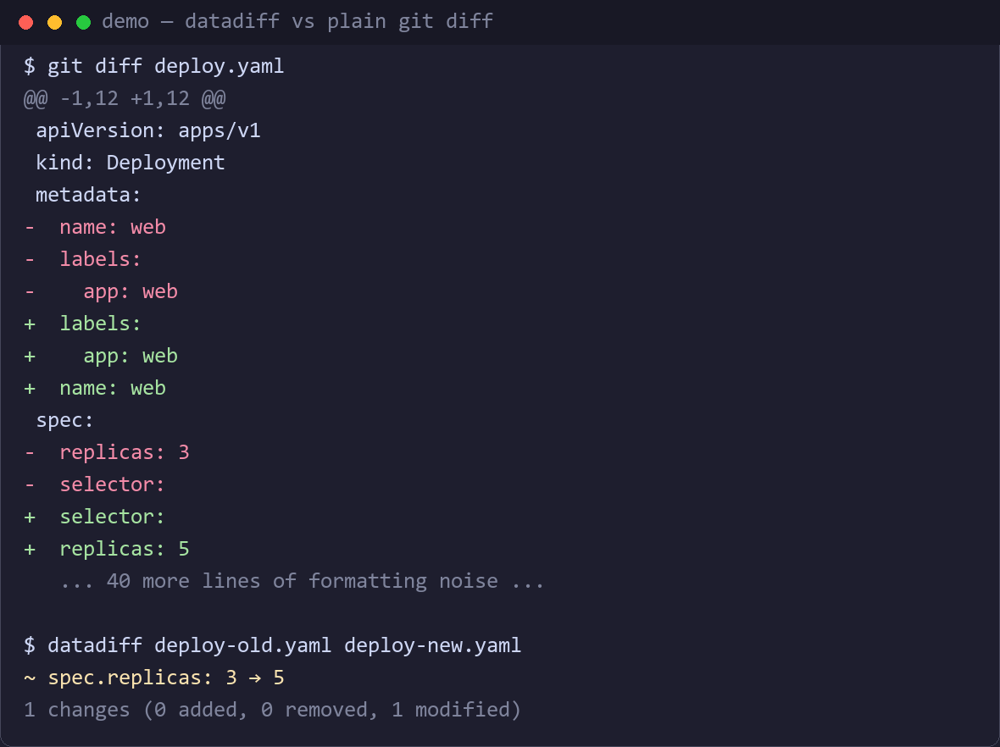

# datadiff

[](https://github.com/dimanovikov/datadiff/actions/workflows/ci.yml)
[](https://crates.io/crates/datadiff)
[](https://github.com/dimanovikov/datadiff/releases/latest)
[](#license)

Semantic diff for structured data files — **JSON, YAML, CSV, TOML, XML**.

`datadiff` understands the *structure* of your data instead of comparing files
line by line. Reordered keys, reformatting and rewrapped YAML produce no
noise; real changes are reported as **data paths**, not line numbers.



## The pain

Plain `diff` on structured files is noisy:

- Reorder keys in a JSON object or reformat a Kubernetes manifest — and every
  line "changed".
- Reorder a JSON array of objects (e.g. a list of users) — and you get a
  wall of false positives.
- In a CSV export, one changed price hides inside a full-file text diff.

`datadiff` parses both files into a data tree and compares *that*:

- Key order and formatting are ignored.
- Arrays of objects can be matched by a key field (`--key id`), so reordering
  is not a change.
- CSV is compared row by row via a key column, reported as
  `row id=4217, column price: 100 → 120` style entries.

## How it compares

| | datadiff | [Graphtage](https://github.com/trailofbits/graphtage) | [dyff](https://github.com/homeport/dyff) | [difftastic](https://github.com/Wilfred/difftastic) |
|---|---|---|---|---|
| Approach | structural data diff | optimal tree edit distance | YAML/JSON data diff | syntax diff for source code |
| Formats | JSON, YAML, CSV, TOML, XML | JSON, YAML, XML, CSV, … | YAML (JSON) | programming languages |
| Arrays matched by key | yes (`--key id`) | heuristic, slow | no | n/a |
| 1,000-object JSON (112 KB) | **0.07 s** | >10 min (timed out) | — | — |
| Patch mode / conversion | yes | no | no | no |
| CI risk policies | yes (`--fail-on`) | no | no | no |

Measured on the same machine with datadiff 0.2.0 and Graphtage 0.3.1:
datadiff finished a 5,000-object JSON diff in 0.1 s; Graphtage did not
finish the 1,000-object file within a 10-minute timeout. The tools make
different trade-offs (Graphtage finds *optimal* matches; datadiff matches
structure predictably) — but for reviewing config changes, predictable and
fast wins.

## Inside `git diff`

The point of datadiff is not to be another command you remember to run. Set it
up once and `git diff` tells the truth about config files, with no change to
how you work.

Here is the same commit three ways. Someone changed the replica count; a
formatter then reordered the file.

**What `git diff` shows you today** — six changed lines, and the one that
matters is buried:

```diff
-apiVersion: apps/v1
 spec:
-  replicas: 3
   template:
     image: app:1.0
+  replicas: 5
+
+apiVersion: apps/v1
```

**What it shows with datadiff wired in:**

```
$ git diff deploy.yaml
deploy.yaml
~ spec.replicas: 3 → 5
1 changes (0 added, 0 removed, 1 modified)
```

**And in history, where a line diff is still what you want — just without the
noise:**

```diff
$ git log -p deploy.yaml
 apiVersion: apps/v1
 spec:
-  replicas: 3
+  replicas: 5
   template:
     image: app:1.0
```

The reordering is gone because both sides are canonicalised before comparison.

### Setup

```sh
git config diff.datadiff.command  "datadiff git-diff"
git config diff.datadiff.textconv "datadiff normalize"

printf '*.json diff=datadiff\n*.yaml diff=datadiff\n' >> .gitattributes
```

Add `--global` to the `git config` lines to apply it everywhere, and commit
`.gitattributes` to share it with the repository.

### What runs where

You never choose at the command line — git picks by what you asked for.

| Command | What runs | Why |
|---|---|---|
| `git diff` | `git-diff` driver | "what changed right now" wants data paths |
| `git log -p`, `git show`, `git blame` | `normalize` textconv | history reads better as a line diff, minus the noise |

Both halves are independent: configure only `command` for a semantic
`git diff`, or only `textconv` for clean output everywhere including pagers
like [delta](https://github.com/dandavison/delta).

To step around them: `git diff --no-ext-diff` gives a line diff of the
canonical form, and adding `--no-textconv` shows the file exactly as it sits
on disk.

Added and deleted files work too — git passes `/dev/null` for the missing
side, and datadiff reports every entry as added or removed rather than as one
opaque change.

Pass any other option ahead of the subcommand. `--key` matters most: without
it a reordered list of containers reads as four changes, with it as one.

```sh
git config diff.datadiff.command "datadiff --key name git-diff"
```

A file datadiff cannot read — one that is not structured data, or one that is
invalid halfway through an edit — prints a short note and does not stop the
diff. As textconv the file passes through unchanged, so `git log -p` falls
back to the diff you would have seen anyway.

## Installation

**Homebrew** (macOS / Linux):

```sh
brew install dimanovikov/datadiff/datadiff
```

**macOS / Linux** — one command, no compiler needed (installs to
`~/.local/bin`):

```sh
curl -fsSL https://raw.githubusercontent.com/dimanovikov/datadiff/main/install.sh | sh
```

**Windows** — in PowerShell (installs to `%LOCALAPPDATA%\Programs\datadiff`
and adds it to the user PATH):

```powershell
irm https://raw.githubusercontent.com/dimanovikov/datadiff/main/install.ps1 | iex
```

**Manually** — grab the archive for your platform from
[GitHub Releases](https://github.com/dimanovikov/datadiff/releases/latest)
(Linux x86_64/ARM, macOS Apple Silicon, Windows x86_64) and put
`datadiff` on your PATH. Intel Macs: use `cargo install datadiff` instead.

**With Rust installed**:

```sh
cargo install datadiff          # from crates.io
cargo install --path .          # from a local checkout
```

## Usage

```sh
datadiff <old> <new> [--key <field>] [--format <json|yaml|csv|toml|xml>]
         [--show-unchanged] [--no-color] [--output <text|json|patch>]
```

The format is autodetected from the file extension; `--format` overrides it.

One side can be read from stdin by passing `-` instead of a file. Since
stdin has no extension, `--format` is required:

```sh
$ kubectl get deploy -o yaml | datadiff - new.yaml --format yaml
```

### Examples

Kubernetes manifests with reordered keys and one real change:

```sh
$ datadiff examples/k8s-old.yaml examples/k8s-new.yaml
~ spec.replicas: 3 → 5
1 changes (0 added, 0 removed, 1 modified)
```

A CSV price list, matched by the `id` column (reordering rows is free):

```sh
$ datadiff examples/products-old.csv examples/products-new.csv --key id
~ $[id=1001].price: 25.99 → 29.99
+ $[id=1006]: {"category":"electronics","id":1006,...}
- $[id=1003]: {"category":"home","id":1003,...}
3 changes (1 added, 1 removed, 1 modified)
```

Machine-readable output for tooling (`--output json`):

```sh
$ datadiff examples/k8s-old.yaml examples/k8s-new.yaml --output json
{
  "changes": [
    { "type": "modified", "path": "spec.replicas", "old": 3, "new": 5 }
  ],
  "summary": { "added": 0, "removed": 0, "modified": 1, "total": 1 }
}
```

### Patch mode

A diff produced with `--output json` can be applied to a file with the
`patch` subcommand. The patched document is printed to stdout as JSON:

```sh
$ datadiff old.yaml new.yaml --output json > changes.json
$ datadiff patch old.yaml changes.json > new.json
```

Changes are applied by data path (`users[id=4217].email`); a path that
cannot be resolved in the target file is an error (exit code 2) — nothing
is skipped silently. Known limitation: object keys containing `.`, `[` or
`]` cannot be patched, because such paths are not representable.

For external tooling there is also `--output patch`, which emits the diff
as a JSON Patch (RFC 6902) document that any json-patch implementation
can apply:

```sh
$ datadiff old.yaml new.yaml --output patch
[
  {
    "op": "replace",
    "path": "/spec/replicas",
    "value": 5
  }
]
```

Key-matched array paths (`users[id=4217].email`) are resolved to the
numeric indices JSON Pointer requires, looked up in the old document;
elements added by key use the RFC 6902 append syntax (`/users/-`).
Removals from one array are ordered by descending index so applying them
does not shift the remaining indices. The `patch` subcommand consumes the
native `--output json` format, not RFC 6902.

A JSON array of objects matched by key — pure reordering reports nothing:

```sh
$ datadiff users-old.json users-new.json --key id
0 changes (0 added, 0 removed, 0 modified)
```

XML follows the same tree diff; attributes are reported under `@name` and
element text under `$text` (quick-xml mapping), and the root element name
is dropped. The same mapping is used when writing XML in `convert`, so an
XML → XML conversion round-trips (wrapped in `<root>`):

```sh
$ datadiff examples/config-old.xml examples/config-new.xml
~ port.$text: "8080" → "9090"
~ tls.@enabled: "false" → "true"
~ tls.@version: "1.2" → "1.3"
3 changes (0 added, 0 removed, 3 modified)
```

### Configuration via .env

Defaults can come from a `.env` file in the working directory
(see [`.env.example`](.env.example)):

| Variable        | Flag               |
| --------------- | ------------------ |
| `DATADIFF_KEY`  | `--key`            |
| `DATADIFF_FORMAT` | `--format`       |
| `DATADIFF_SHOW_UNCHANGED` | `--show-unchanged` |
| `DATADIFF_NO_COLOR` | `--no-color`   |
| `DATADIFF_OUTPUT` | `--output`       |
| `DATADIFF_EXIT_ZERO` | `--exit-zero` |
| `DATADIFF_FAIL_ON` | `--fail-on`     |

Priority: CLI flag > `.env` > built-in default.

### Use as a git diff driver

To make `git diff` show semantic changes for structured files, register
`datadiff` as an external diff driver. Git calls the driver with seven
arguments, so the command picks out the two temp files (`$2` and `$5`):

```sh
git config diff.datadiff.command 'f() { datadiff --exit-zero "$2" "$5"; }; f'
```

```gitattributes
# .gitattributes
*.json diff=datadiff
*.yaml diff=datadiff
*.yml  diff=datadiff
```

`--exit-zero` is required: git treats a non-zero exit from the driver as a
failure, while `datadiff` normally exits 1 when differences are found.
Added and deleted files are handled: git passes `/dev/null` for the missing
side, which `datadiff` treats as an empty document.

### Use with git difftool / vim

`git difftool` can hand both sides to `datadiff` instead of a side-by-side
tool — useful when you want the semantic summary rather than a text diff:

```sh
git difftool --no-prompt --extcmd 'datadiff --exit-zero'
```

And to read the diff in vim (or pipe it anywhere else):

```sh
datadiff old.yaml new.yaml | vim -R -
```

### Format conversion

All supported formats parse into the same data tree, so files can be
converted between them (the output format comes from the extension):

```sh
$ datadiff convert config.yaml config.json
$ datadiff convert rows.json rows.csv
```

Limits: TOML needs an object at the document root (and no nulls), CSV needs
an array of flat objects, and XML needs an object at the document root.
Since parsing does not retain the XML root element name, written XML is
always wrapped in `<root>`. Such mismatches are reported as errors (exit
code 2).

### Risk policies for CI (`--fail-on`)

In CI you often want the gate to fail only on *risky* changes, not on
cosmetic ones. `--fail-on` takes path patterns (repeatable or
comma-separated); the exit code is 1 only when a change path matches:

```sh
$ datadiff old.yaml new.yaml --fail-on spec.replicas,*.image
~ spec.replicas: 3 → 5
~ spec.template.labels.team: "a" → "b"
2 changes (0 added, 0 removed, 2 modified)   # exit code 1: replicas matched
```

A pattern matches when it equals the path, is a dot-segment prefix of it
(`spec` matches `spec.replicas`), or uses `*` globs (`*.image`). Changes
that match nothing still print but exit 0.

For GitHub Actions there is a ready-made wrapper —
[dimanovikov/datadiff-action](https://github.com/dimanovikov/datadiff-action):

```yaml
- uses: dimanovikov/datadiff-action@v1
  with:
    old: base/deploy/app.yaml
    new: deploy/app.yaml
    fail-on: spec.replicas,*.image
```

### Output legend

- `~ path: old → new` — modified (yellow)
- `+ path: value` — added (green)
- `- path: value` — removed (red)
- `= path` — unchanged (grey, only with `--show-unchanged`)

Paths use dot notation (`services.web.replicas`); array elements are
`users[3].email` by index, or `users[id=4217].email` when matched by `--key`.
Scalar values are rendered in JSON representation.

### Exit codes

- `0` — no differences
- `1` — differences found
- `2` — error (file not found, invalid format)

The `0`/`1` split makes `datadiff` drop-in usable in CI gates and scripts.

## License

Dual-licensed under either of [MIT](LICENSE-MIT) or
[Apache-2.0](LICENSE-APACHE) at your option.
